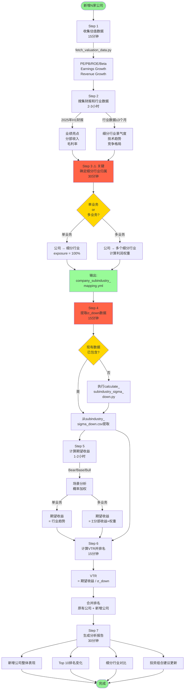
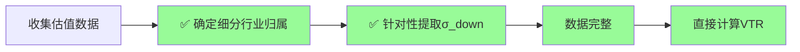
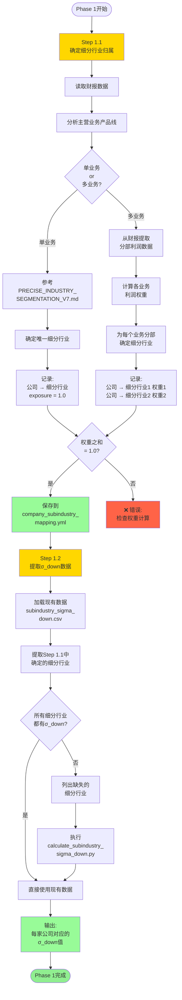
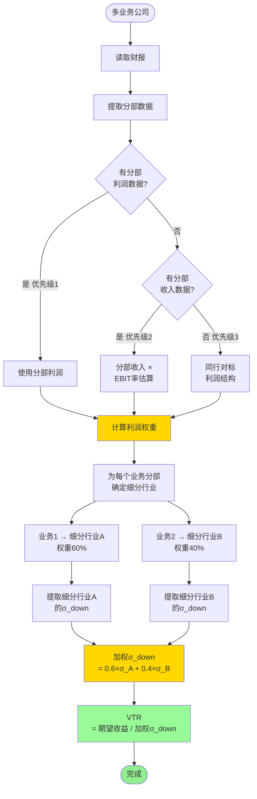
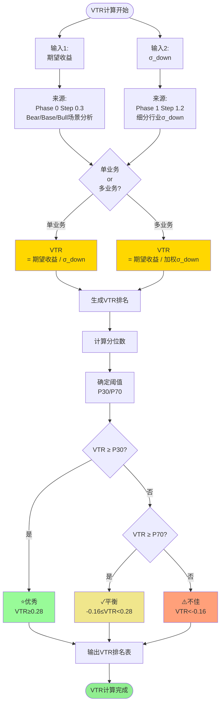
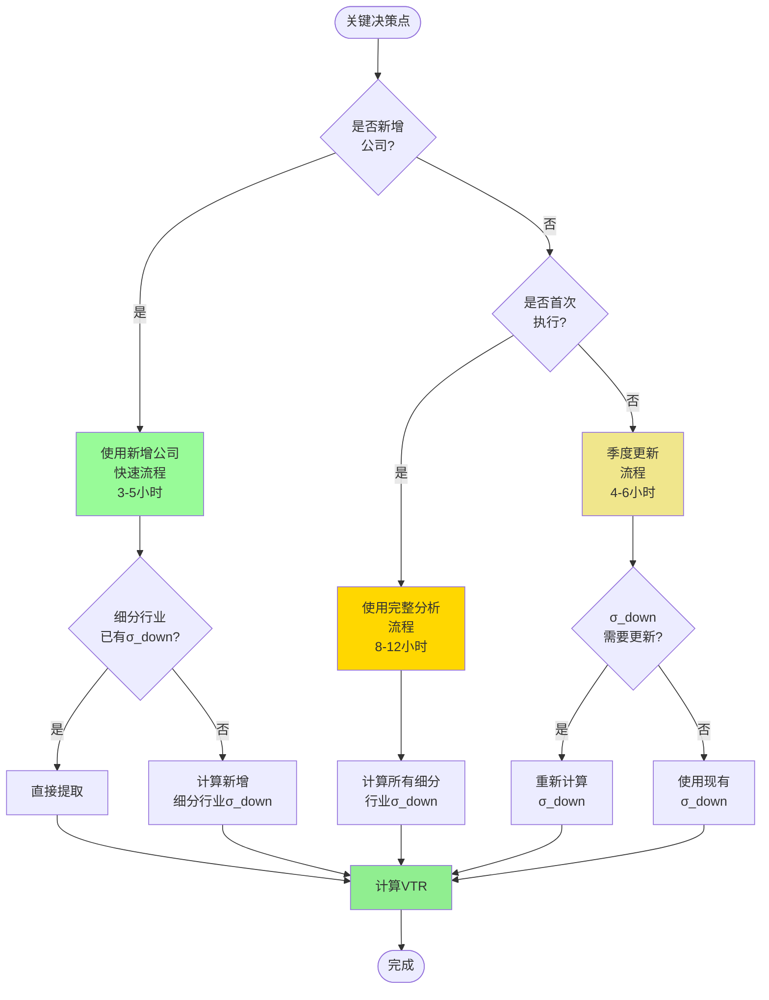
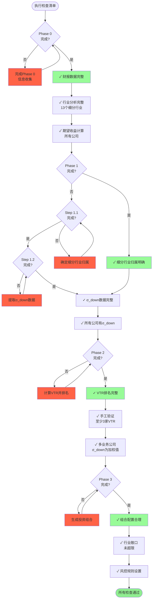
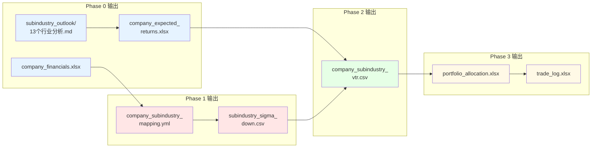

# V7.3 执行流程图

**目标**: 可视化展示VTR分析的完整执行流程

**版本**: V7.3 (2025-10-08更新)

**关键修正**: 新增公司时，必须先确定细分行业归属，再提取σ_down数据

---

## 🎯 完整分析流程图 (首次执行)

```mermaid
graph TD
    Start([开始VTR分析]) --> Phase0{Phase 0<br/>信息收集}

    Phase0 --> Step01[Step 0.1<br/>获取财报数据<br/>1-2小时]
    Step01 --> |Yahoo Finance API|Val01[估值数据<br/>PE/PB/ROE/Beta]
    Step01 --> |财报披露|Fin01[分部收入/利润<br/>EBIT率/资产负债表]

    Val01 --> Step02[Step 0.2<br/>分析行业现状<br/>2-3小时]
    Fin01 --> Step02
    Step02 --> |13个细分行业|Ind01[行业景气度<br/>技术迭代<br/>政策环境]
    Step02 --> |Bear/Base/Bull|Sce01[场景概率分配]

    Ind01 --> Step03[Step 0.3<br/>建立个股预期<br/>1-2小时]
    Sce01 --> Step03
    Fin01 --> Step03
    Step03 --> |单业务|Exp01[期望收益<br/>= 行业趋势]
    Step03 --> |多业务|Exp02[期望收益<br/>= Σ分部收益×权重]

    Exp01 --> Phase1{Phase 1<br/>风险计算}
    Exp02 --> Phase1

    Phase1 --> Step11[Step 1.1 ⚠️ 新增<br/>确定细分行业归属<br/>0.3小时]
    Step11 --> |单业务|Map01[公司 → 细分行业<br/>exposure = 100%]
    Step11 --> |多业务|Map02[公司 → 多个细分行业<br/>按利润权重分配]

    Map01 --> Step12[Step 1.2<br/>提取σ_down数据<br/>0.2小时]
    Map02 --> Step12
    Step12 --> |检查现有数据|Check01{data/subindustry_<br/>sigma_down.csv<br/>有数据?}
    Check01 --> |是|Sigma01[直接提取σ_down]
    Check01 --> |否|Calc01[执行计算脚本<br/>calculate_subindustry_<br/>sigma_down.py]
    Calc01 --> Sigma01

    Sigma01 --> Phase2{Phase 2<br/>VTR计算}

    Phase2 --> Step21[Step 2.1<br/>建立公司-细分行业映射<br/>0.2小时]
    Step21 --> |配置文件|Map03[COMPANY_SUBINDUSTRY_<br/>EXPOSURE]

    Map03 --> Step22[Step 2.2<br/>计算VTR并排名<br/>0.3小时]
    Step22 --> |单业务|VTR01[VTR = 期望收益 / σ_down]
    Step22 --> |多业务|VTR02[VTR = 期望收益 / <br/>加权σ_down]

    VTR01 --> Rank01[生成VTR排名表]
    VTR02 --> Rank01
    Rank01 --> |Top30%|Tier1[⭐优秀<br/>VTR≥0.28]
    Rank01 --> |30-70%|Tier2[✓平衡<br/>-0.16≤VTR<0.28]
    Rank01 --> |Bottom30%|Tier3[⚠️不佳<br/>VTR<-0.16]

    Tier1 --> Phase3{Phase 3<br/>投资决策}
    Tier2 --> Phase3
    Tier3 --> Phase3

    Phase3 --> Step31[Step 3.1<br/>生成投资组合<br/>1小时]
    Step31 --> Port01[核心层<br/>60-80%<br/>优秀标的]
    Step31 --> Port02[灵活层<br/>10-30%<br/>平衡标的]
    Step31 --> Port03[现金<br/>3-5%]

    Port01 --> Step32{Step 3.2<br/>回测验证<br/>可选}
    Port02 --> Step32
    Port03 --> Step32
    Step32 --> |执行回测|Back01[回测2020-2025<br/>对比基准]
    Step32 --> |跳过|Step33

    Back01 --> Step33[Step 3.3<br/>执行交易<br/>1小时]
    Step33 --> Trade01[交易指令<br/>分批执行<br/>设置止损]

    Trade01 --> End([完成])

    style Start fill:#90EE90
    style End fill:#90EE90
    style Phase0 fill:#FFD700
    style Phase1 fill:#FFD700
    style Phase2 fill:#FFD700
    style Phase3 fill:#FFD700
    style Step11 fill:#FF6347
    style Step12 fill:#FF6347
    style Tier1 fill:#98FB98
    style Tier2 fill:#F0E68C
    style Tier3 fill:#FFA07A
```



---

## 🆕 新增公司快速流程图



---

## ⚠️ 执行顺序对比 (错误 vs 正确)

### ❌ 错误流程 (顺序颠倒)


**问题**:
1. 不知道需要哪些细分行业的σ_down，盲目提取
2. 可能提取了不需要的数据，浪费时间
3. 确定细分行业后发现缺少数据，需要重新提取

---

### ✅ 正确流程 (顺序合理)



**优势**:
1. 先明确需要哪些细分行业
2. 针对性提取σ_down数据，高效准确
3. 避免重复工作，节省时间

---

## 📊 Phase 1详细流程图 (关键修正)



---

## 🔄 多业务公司处理流程



**案例: 紫金矿业**

```yaml
分部利润 (优先级1):
  铜业务: 180亿 (60%)
  黄金业务: 120亿 (40%)

细分行业归属:
  铜业务 → 铜矿开采 (σ_down = 23.02%)
  黄金业务 → 黄金开采 (σ_down = 13.06%)

加权σ_down:
  = 0.6 × 23.02% + 0.4 × 13.06%
  = 13.81% + 5.22%
  = 19.04%

期望收益: -24.0%

VTR:
  = -24.0% / 19.04%
  = -1.26
```

---

## 📈 VTR计算完整流程



---

## 🎯 关键决策点流程



---

## 📝 执行检查清单流程



---

## 🔧 脚本执行流程

### calculate_subindustry_sigma_down.py

```mermaid
graph TD
    Start([执行脚本]) --> Config1[读取细分行业<br/>ETF映射配置]

    Config1 --> Loop1[遍历13个<br/>细分行业]

    Loop1 --> Fetch1[Yahoo Finance API<br/>获取ETF历史数据]
    Fetch1 --> Q1{数据<br/>完整?}

    Q1 --> |是|Calc1[计算日收益率]
    Q1 --> |否|Error1[❌ 错误:<br/>数据缺失]

    Calc1 --> Calc2[下行收益<br/>= returns[returns<0]]
    Calc2 --> Calc3[σ_down<br/>= std(下行收益)×√252]
    Calc3 --> Calc4[σ_total<br/>= std(全部收益)×√252]

    Calc4 --> Store1[存储结果<br/>σ_down / σ_total / days]

    Store1 --> Q2{还有<br/>细分行业?}
    Q2 --> |是|Loop1
    Q2 --> |否|Output1[保存到<br/>subindustry_sigma_<br/>down.csv]

    Output1 --> Summary1[打印汇总表<br/>对比大行业差异]

    Summary1 --> End([完成])

    style Calc3 fill:#FFD700
    style Output1 fill:#98FB98
    style End fill:#90EE90
    style Error1 fill:#FF6347
```

---

### build_company_subindustry_mapping.py

```mermaid
graph TD
    Start([执行脚本]) --> Config1[读取配置<br/>SUBINDUSTRY_SIGMA_DOWN]

    Config1 --> Config2[读取配置<br/>COMPANY_SUBINDUSTRY_<br/>EXPOSURE]

    Config2 --> Loop1[遍历所有公司]

    Loop1 --> Q1{单业务<br/>or<br/>多业务?}

    Q1 --> |单业务|Get1[获取细分行业<br/>σ_down]
    Q1 --> |多业务|Calc1[计算加权σ_down<br/>Σ(σ_i × weight_i)]

    Get1 --> VTR1[VTR<br/>= 期望收益 / σ_down]
    Calc1 --> VTR1

    VTR1 --> Store1[存储VTR结果]

    Store1 --> Q2{还有<br/>公司?}
    Q2 --> |是|Loop1
    Q2 --> |否|Sort1[按VTR降序排序]

    Sort1 --> Percentile1[计算P30/P70分位数]
    Percentile1 --> Grade1[分配评级<br/>优秀/平衡/不佳]

    Grade1 --> Output1[保存到<br/>company_subindustry_<br/>vtr.csv]

    Output1 --> Print1[打印排名表]
    Print1 --> Compare1[打印V7.2 vs V7.3<br/>对比表]

    Compare1 --> End([完成])

    style VTR1 fill:#FFD700
    style Grade1 fill:#FFD700
    style Output1 fill:#98FB98
    style End fill:#90EE90
```

---

## 📊 数据流向图



---

## 🎯 总结: 执行流程关键要点

### 1. 顺序不可颠倒

```
✅ 正确顺序:
  收集估值数据
    ↓
  确定细分行业归属 (Step 1.1)
    ↓
  提取σ_down数据 (Step 1.2)
    ↓
  计算VTR

❌ 错误顺序:
  收集估值数据
    ↓
  提取σ_down数据 ← 不知道需要哪些
    ↓
  确定细分行业归属 ← 发现缺少数据
    ↓
  重新提取σ_down ← 浪费时间
```

### 2. 多业务公司处理

```
1. 提取分部利润数据 (优先级1)
   ↓
2. 计算利润权重
   ↓
3. 为每个业务分部确定细分行业
   ↓
4. 提取各细分行业σ_down
   ↓
5. 加权计算: Σ(σ_i × weight_i)
```

### 3. 数据时效性检查

```
Phase 0:
  - Yahoo Finance估值: <7天
  - 财报数据: 最新季报/年报
  - 行业信息: ≤3个月

Phase 1:
  - σ_down数据: 每季度更新

Phase 2:
  - VTR排名: 每季度更新

Phase 3:
  - 投资组合: 每季度调整
```

### 4. 质量检查点

```
Phase 0完成后:
  ✓ 财报数据完整
  ✓ 13个细分行业分析完整
  ✓ 所有公司有期望收益

Phase 1完成后:
  ✓ 细分行业归属明确
  ✓ σ_down数据完整
  ✓ 多业务公司权重之和=1.0

Phase 2完成后:
  ✓ VTR排名完整
  ✓ 手工验证至少3家VTR
  ✓ 多业务公司σ_down为加权值

Phase 3完成后:
  ✓ 组合配置合理
  ✓ 行业敞口未超限
  ✓ 风控规则设置
```

---

**文档版本**: V7.3 Execution Flowchart
**创建日期**: 2025-10-08
**维护者**: @LpcPaul

**主要更新**:
- 新增Step 1.1: 确定细分行业归属 (在提取σ_down之前)
- 强调执行顺序的重要性
- 增加多业务公司处理流程图
- 增加错误vs正确流程对比图
- 增加数据流向图
